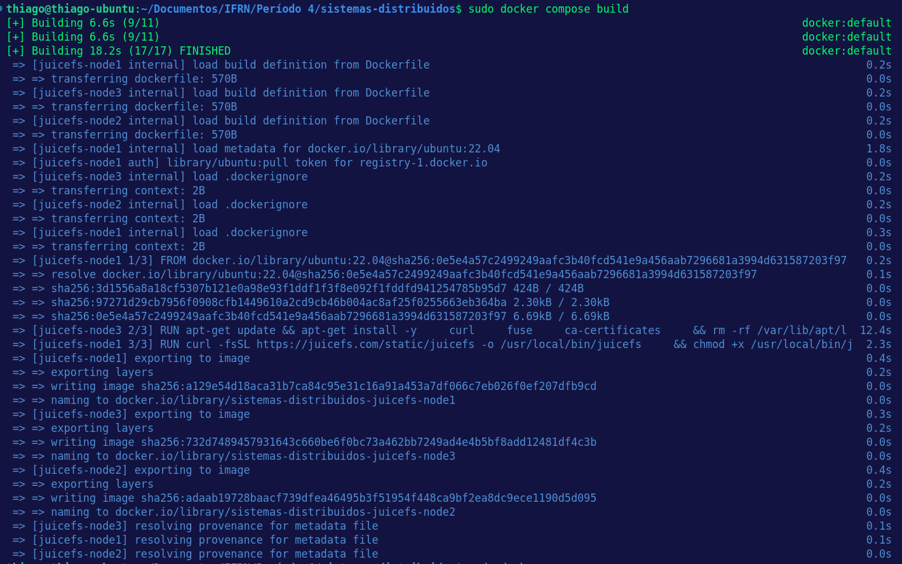
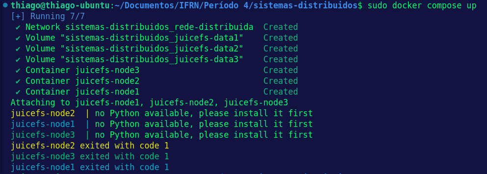

# Pesquisa sobre o JuiceFS

## O que é o JuiceFS?

O **JuiceFS** é um sistema de arquivos distribuído, compatível com POSIX e open-source. Ele foi criado para armazenar grandes volumes de dados de forma eficiente, aproveitando o armazenamento de objetos (como Amazon S3, Google Cloud Storage, etc.). O grande diferencial dele é que você consegue usar sistemas de armazenamento de objetos como se fossem sistemas de arquivos normais, como o que usamos no Linux.

## Como Funciona?

O JuiceFS separa os **metadados** (informações sobre os arquivos, como permissões, tamanhos e datas) dos **dados** propriamente ditos. Os dados vão para um sistema de armazenamento de objetos, enquanto os metadados são gerenciados por um banco de dados (pode ser Redis, MySQL, entre outros). Isso torna o JuiceFS bem rápido e escalável.

### Principais Características:

1. **Compatibilidade com POSIX**:
   - Funciona como um sistema de arquivos normal, o que facilita muito para quem já está acostumado com Linux. Você pode fazer operações como copiar, mover e editar arquivos.

2. **Escalabilidade**:
   - Como ele usa armazenamento de objetos, você consegue escalar o armazenamento sem muita dificuldade, ótimo para trabalhar com volumes massivos de dados.

3. **Caching Inteligente**:
   - Ele usa cache local para melhorar o desempenho. Isso é bem útil se você está acessando os mesmos arquivos repetidamente.

4. **Baixo Custo**:
   - Utilizar serviços de armazenamento de objetos, como o Amazon S3, pode sair mais barato do que outras soluções de armazenamento de dados.

## Tópicos

### **Transparência**

O **JuiceFS** proporciona uma experiência de sistema de arquivos transparente e familiar para usuários que já estão acostumados com sistemas de arquivos POSIX, como os encontrados em distribuições Linux. Ele permite realizar operações básicas de sistema de arquivos, como copiar, mover e editar, sem a necessidade de aprender comandos novos ou específicos. Essa transparência é alcançada ao apresentar o armazenamento de objetos (como Amazon S3 e Google Cloud Storage) como um sistema de arquivos normal, o que facilita a integração com ferramentas e fluxos de trabalho já existentes.

### **Escalabilidade**

Um dos pontos fortes do JuiceFS é sua capacidade de escalar o armazenamento conforme necessário, aproveitando os serviços de armazenamento de objetos na nuvem, que são altamente escaláveis. Essa arquitetura permite ao sistema lidar eficientemente com grandes volumes de dados, tornando-o ideal para aplicações que demandam alta capacidade de armazenamento, como Big Data e Machine Learning. Além disso, o design do JuiceFS separa metadados e dados: os dados vão para o armazenamento de objetos, enquanto os metadados são gerenciados por um banco de dados. Isso facilita a escalabilidade, pois o sistema de armazenamento pode crescer sem limitações rígidas.

### **Segurança**

O JuiceFS utiliza os recursos de segurança integrados dos provedores de armazenamento de objetos, como criptografia e autenticação baseada em permissões. Ele também permite o controle de acesso aos dados através das permissões POSIX, proporcionando uma camada adicional de segurança. Em ambientes em nuvem, ele pode tirar proveito das medidas de segurança oferecidas pela infraestrutura do provedor, como criptografia em repouso e em trânsito, garantindo a integridade e confidencialidade dos dados.

### **Tolerância a Falhas**

Ao armazenar os dados em serviços de armazenamento de objetos distribuídos e altamente redundantes, o JuiceFS herda a tolerância a falhas desses sistemas. Mesmo que uma parte do sistema falhe, o armazenamento distribuído garante que os dados continuem disponíveis. Além disso, a arquitetura separada de metadados e dados permite que o sistema se recupere rapidamente em caso de falhas. O cache local também ajuda a melhorar a confiabilidade, garantindo que dados acessados recentemente estejam disponíveis mesmo que o sistema de armazenamento remoto fique temporariamente inacessível.

### **Consistência**

Para garantir a consistência dos dados, o JuiceFS gerencia os metadados de maneira centralizada usando um banco de dados compatível com ACID, como MySQL ou Redis. Isso assegura que operações de leitura e escrita respeitem a ordem de execução, proporcionando consistência nos dados acessados. Esse gerenciamento centralizado dos metadados ajuda a evitar problemas de concorrência e inconsistência de dados, especialmente em operações distribuídas. A compatibilidade com POSIX garante que as operações de arquivo sigam uma semântica consistente e previsível.

---

## Casos de Uso

- **Big Data e Machine Learning**: Se você trabalha com grandes volumes de dados, o JuiceFS ajuda a armazenar e acessar esses dados de forma rápida e eficiente.
- **Backups e Arquivos de Longo Prazo**: Como ele aproveita o armazenamento de objetos, é uma boa solução para backups e arquivamento.
- **Ambientes em Nuvem**: Ideal para quem usa pipelines de dados na nuvem ou precisa integrar várias aplicações que precisam acessar grandes volumes de dados.

## Conclusão

O JuiceFS é uma solução prática para quem precisa de muito espaço para armazenar dados e quer uma maneira eficiente de acessar e gerenciar tudo. Se você lida com big data, machine learning, ou precisa de um sistema de arquivos distribuído, vale a pena dar uma olhada nele.

## Docker Compose Build

## Docker Compose Up

